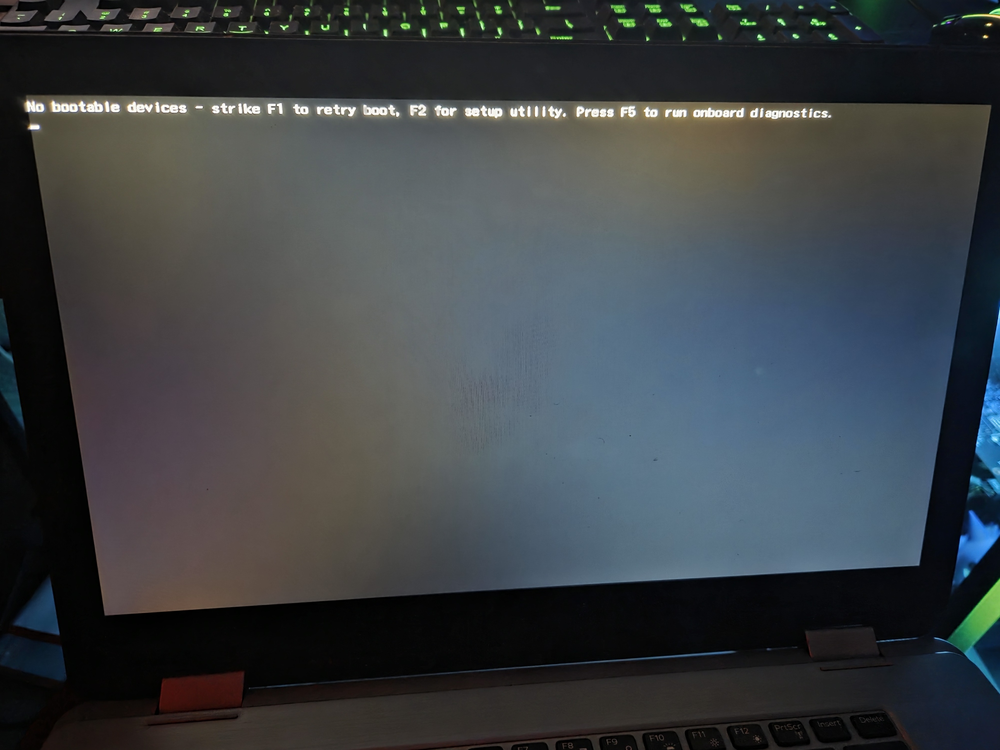
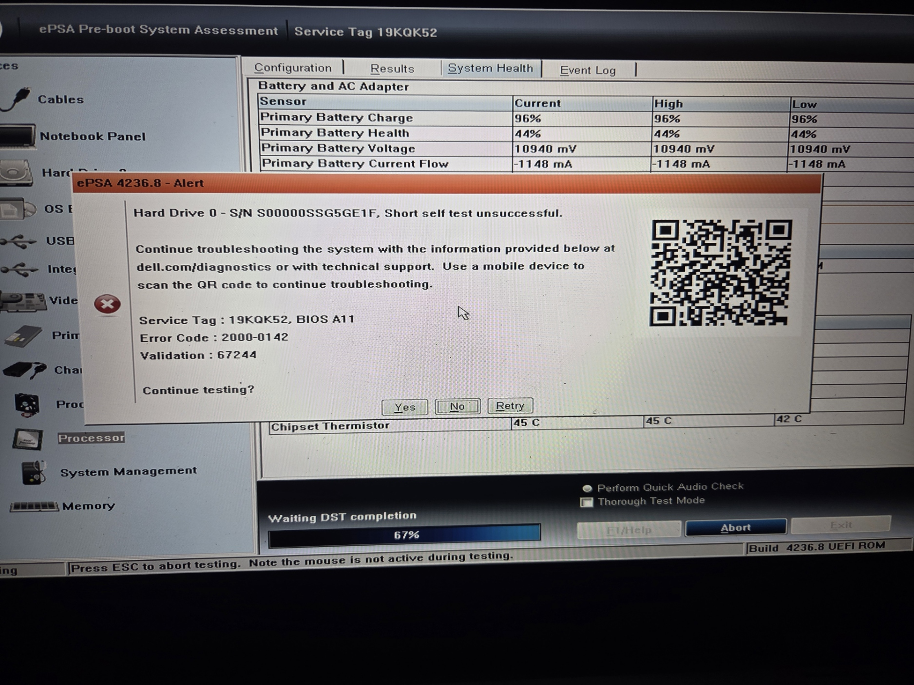
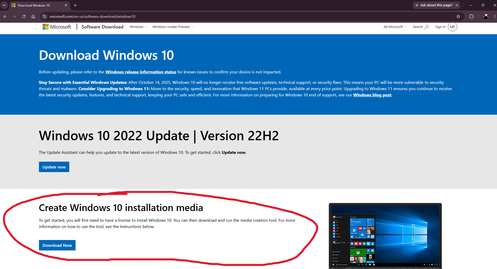

# Case Study: Dell Laptop Storage Repair, SSD Upgrade & Windows 10 Install

## Summary
Diagnosed a complete boot failure on a Dell laptop due to a failed mechanical HDD. Hardware diagnostics revealed a physical S.M.A.R.T. failure on the 1TB HDD. Repaired the system by upgrading to a SSD by extracting the failed HDD and mounting a SATA SSD. Performed a clean OS install with a bootable USB generated using the Windows 10 Media Creation Tool, restoring full functionality and improving system responsivness.

## 1. Initial Diagnostics & Error Identification

### Symptoms
Upon powering up the laptop, the system failed to boot into the OS and displayed a bootloader error (eg. "No bootable devices -strike F1 to retry boot, F2 for setup utility. Press F5 to run onboard diagnostics."). See Image 1.1.

  

  Image 1.1: Bootloader error after system failing to boot.

### Hardware Diagnostic Assessment
To decide whether corrupted boot files or a physical disk failure caused this issue, Dell's ePSA Pre-boot System Assessment was executed by pressing F5 key. See Image 1.2.

* Diagnostic Result: Hardware alert was triggered during the short self test.
* Error Code: 2000-0142
* Validation Code: 67244
* Result Details: Hard Drive 0 - Short self test unsuccessful.
* Conclusion: The failed HDD is the cause of the boot failure. Storage upgrade is required.

  

  Image 1.2: ePSA hardware alert.

## 2. Bootable USB Installation Media Creation
To prepare for OS deployment after replacing the HDD, a bootable USB installer was made using a secondary PC.
1. Software Retrieval: Navigated to the official Microsoft Software Download page and retrieved the Windows 10 Media Creation Tool.

  

2. USB Preparation: Inserted a 8GB USB into PC and executed a FAT32 Quick Format to clear all data.

  

3. Media34tfwfwfwef
4. Mediaweffffffffffffffffff

